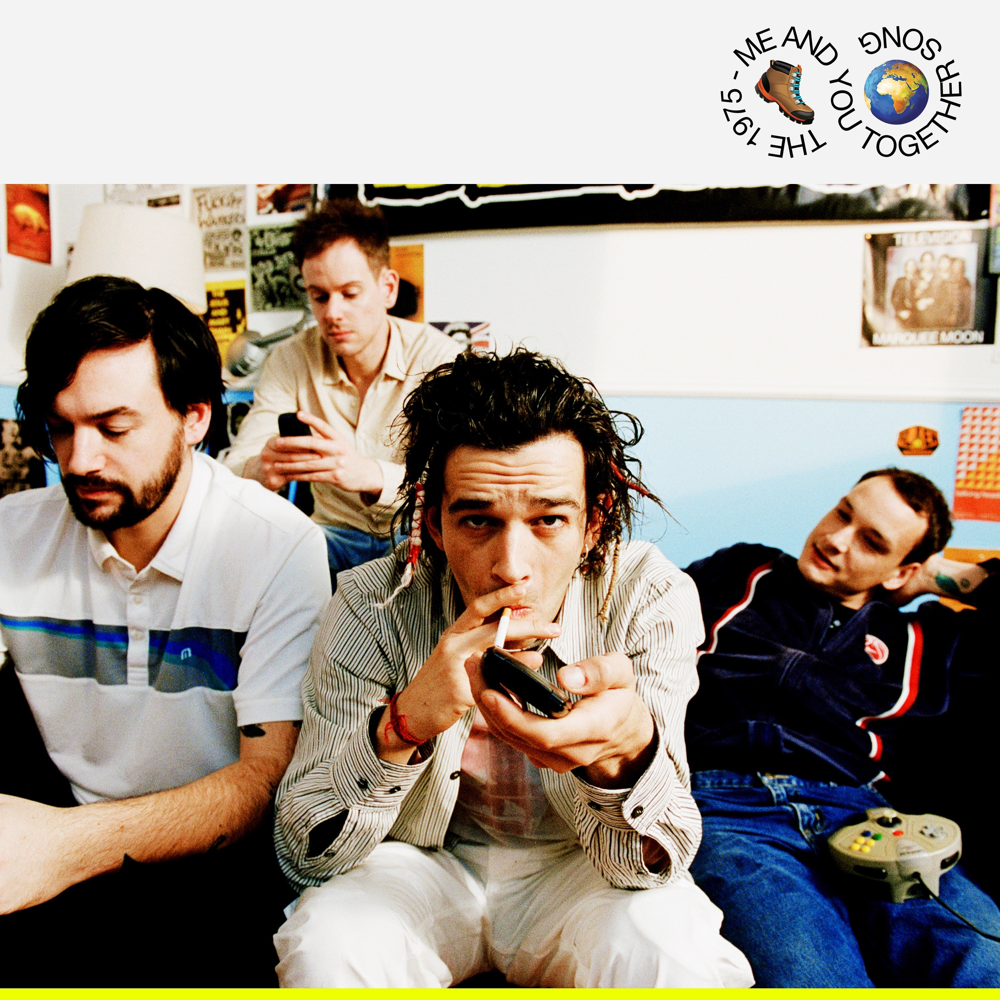
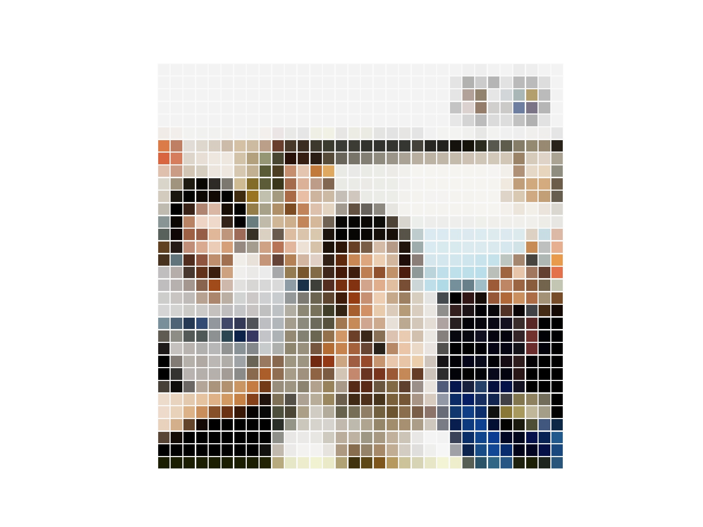
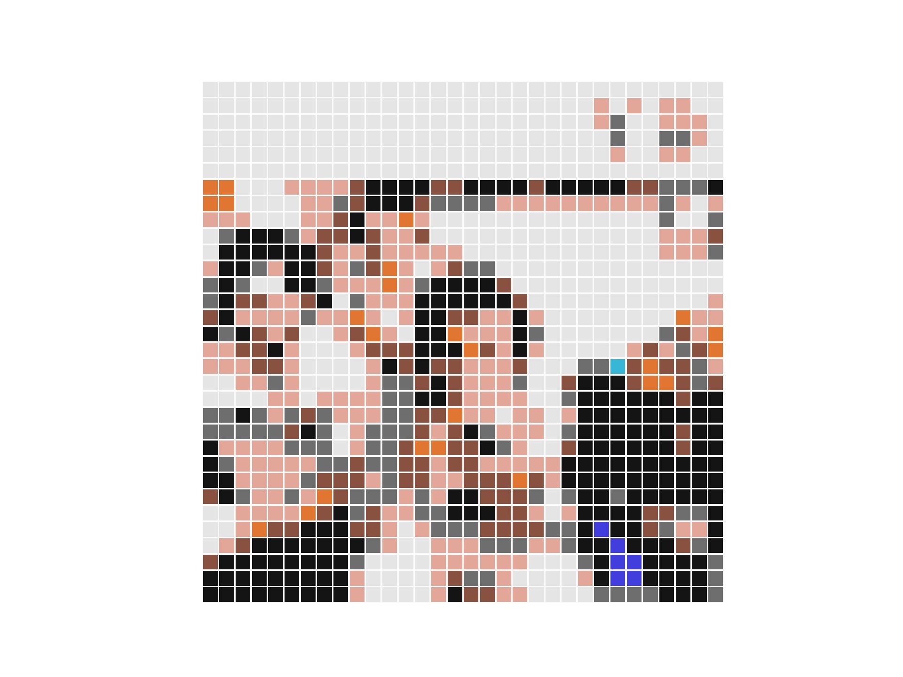

# Animal_crossing_pixel_painting
Converter an image to a pixel image and a pixel image in animal crossing color table

Yuhang Zhou

3/25/2020

## LocalSetup:

Python3
matplotlib
numpy
```
pip install numpy
pip install matplotlib
```
or
```
pip3 install numpy
pip3 install matplotlib
```

## Guide:

* Download and open the `pixel_converter.py` file
* Put your picture in the **images** folder
* Change the **filename** in **pixel_converter.py** to your picture file name
* `python pixel_converter.py` or `python3 pixel_converter.py`

## Sample:

* Original Image:

* Pixel Image:

* Pixel Image In Animal Crossing Colortable:

